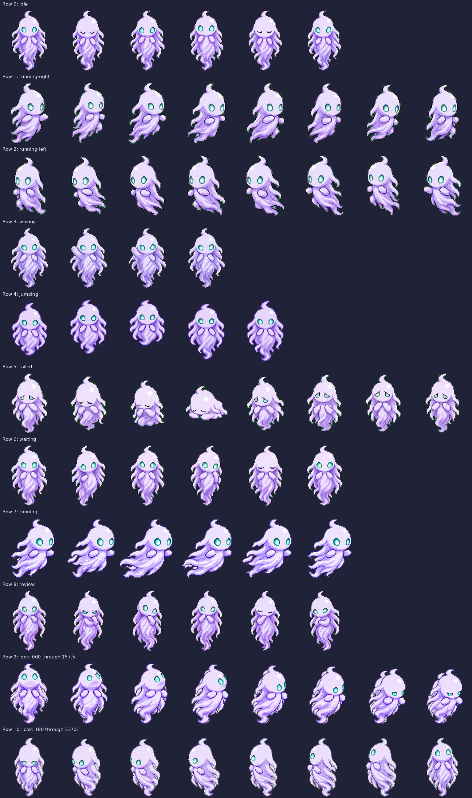

# Float Ghost Codex Pet

Float Ghost is a small ghost-wisp companion, packaged as a standalone custom pet repository.



## Motion update

- Wispy directional gliding in the doing/thinking animation, without a leg or foot cycle
- A jump with a visible upward lift, descent, and return to the resting baseline
- Sixteen clockwise look directions, including a clear upward gaze
- Minimal edge and registration cleanup while retaining Float Ghost's existing identity

The runtime WebP is lossless: its decoded RGBA pixels exactly match the source PNG used for the installed motion revision.

## Compatibility

This update changes the atlas from the repository's original **v1 `1536x1872`, 8-column by 9-row** layout to **v2 `1536x2288`, 8-column by 11-row**. The cell size remains `192x208`. Rows 0–8 retain the original state order; rows 9–10 add the sixteen look directions.

Use these files with a pet consumer that supports the extended v2 layout. The manifest retains `spriteVersionNumber: 2` from the existing v2 update. Compatibility with older clients has not been tested. Keep the original runtime files if your client only accepts the nine-row format.

## Install in a compatible local client

Copy the two runtime files in `pet/` into your Codex pets directory. Back up your existing files first.

PowerShell:

```powershell
$petRoot = Join-Path $HOME ".codex\pets\float-ghost"
New-Item -ItemType Directory -Force -Path $petRoot | Out-Null
Copy-Item -Path ".\pet\pet.json", ".\pet\spritesheet.webp" -Destination $petRoot -Force
```

macOS/Linux:

```bash
mkdir -p ~/.codex/pets/float-ghost
cp pet/pet.json pet/spritesheet.webp ~/.codex/pets/float-ghost/
```

After copying the files, open Settings → Pets, select Refresh, then choose Float Ghost.

## Pet contract

- Pet id: `float-ghost`
- Display name: `Float Ghost`
- Sprite contract: v2 (`spriteVersionNumber: 2`)
- Runtime files: `pet/pet.json`, `pet/spritesheet.webp`
- Source artwork: `source/spritesheet.png`
- Atlas: `1536x2288` transparent, lossless WebP
- Grid: `8x11` cells, each `192x208`
- Required frames: 73; unused transparent cells: 15
- Standard states, rows 0–8: `idle`, `running-right`, `running-left`, `waving`, `jumping`, `failed`, `waiting`, `running`, `review`
- Row 9: `000`, `022.5`, `045`, `067.5`, `090`, `112.5`, `135`, `157.5`
- Row 10: `180`, `202.5`, `225`, `247.5`, `270`, `292.5`, `315`, `337.5`
- Look coordinates: `000` up, `090` screen-right, `180` down, `270` screen-left

The existing v2 `pet.json` fields and identity are preserved. `spritesheetPath` remains `spritesheet.webp`.

## Previews and checks

- `preview/contact-sheet.png` shows all eleven rows
- `preview/look-directions.png` labels the sixteen directions from the final runtime atlas
- `preview/base-transparent-preview.png` shows the resting sprite
- `preview/gifs/` and `preview/videos/` show each standard state, the look loop, the idle-to-jump transition, and complete motion
- `preview/gifs/gliding-left-right.gif` demonstrates screen travel using the encoded doing/thinking frames; translation and leftbound mirroring happen only in the preview
- `validation/validation.json` records the structural checks and exact source/runtime pixel comparison
- `validation/package-notes.json` records the atlas version and source pixel hash

The supplied checks cover atlas dimensions, populated and unused cells, transparency, metadata, and lossless pixel equality. They do not test a local Codex client. The source-package notes report prior motion and direction review and identify the near-vertical `337.5` pose's subtle leftward component as a minor reviewed limitation.

To rebuild the WebP and previews:

```bash
python3 -m pip install -r tools/requirements.txt
python3 tools/build_assets.py
python3 tools/build_assets.py --check
```

MP4 generation requires `ffmpeg` with `libx264`. Use `--no-videos` to regenerate the WebP and GIFs without it. WebP and preview encoded bytes can vary with encoder versions; the decoded source/runtime RGBA equality is the invariant.

This pet was originally generated under the `buddy` working name and packaged for sharing as `float-ghost`.

## License

No license has been selected for this repository yet.
